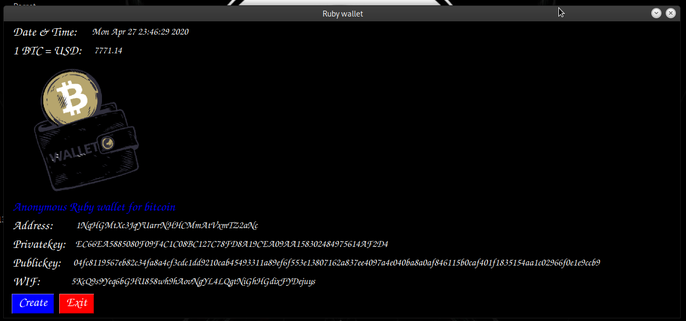
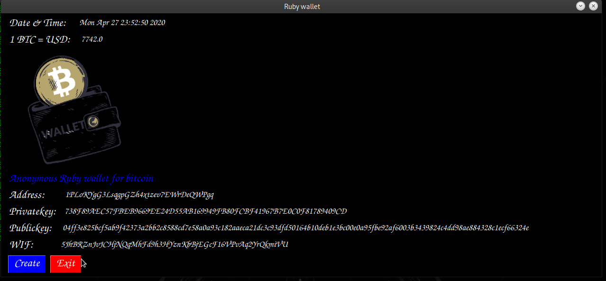

Ruby Bitcoin Wallet
![Ruby wallet]/*(n.png)
```

Sample:

```
Wallet: 

Privatekey: 224B75C379939BE1FC2961B9462723C48050975F72D24569DA7DE6513944F08F
Publickey:  04c64330f1db10a1bcf8381d1fab42913ab48bf541bb47682421f3e7a6306ef694b9041f2f582691a29c504ba0d082cd15804116bccda5d65a0cb8e94369c69bd7
Address:    1LVxWJg34vjgE5mCDm1Sv7taWHizT9HSWr
WIF:        5J5PbUjzZuEcznEFdVKQE4sCyaYvhtmzDtRYT3kP3rM5FYWVxz7
```




Donate small amount of Btc to support my project.
33hJyoqkCfQQMABZ4ea1DxqwwZfK5iPrVZ


